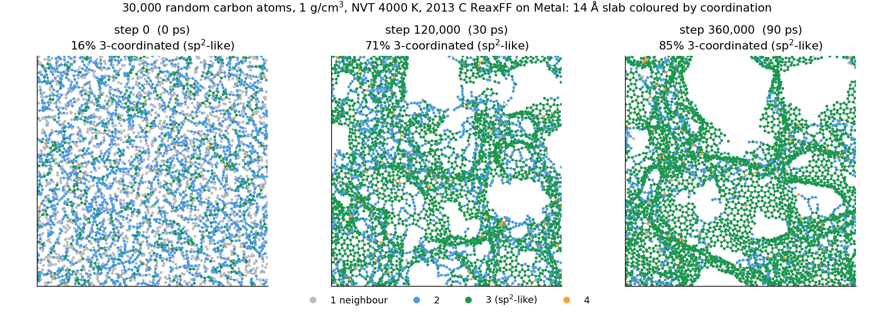
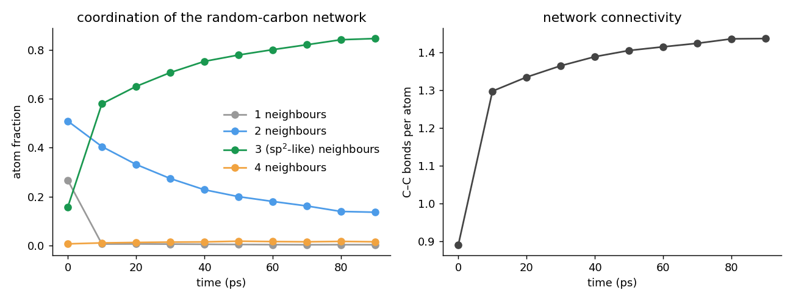
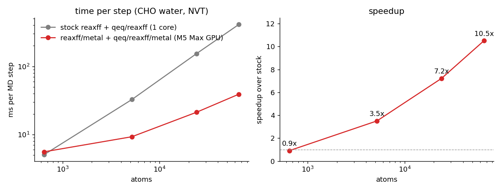
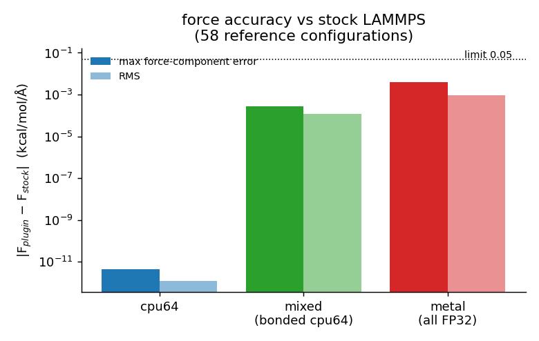
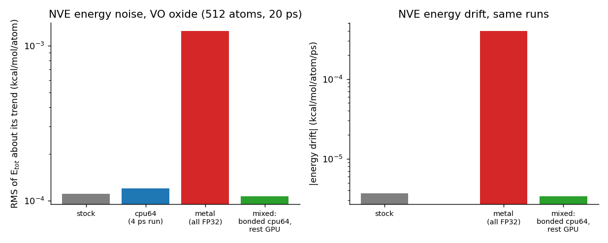
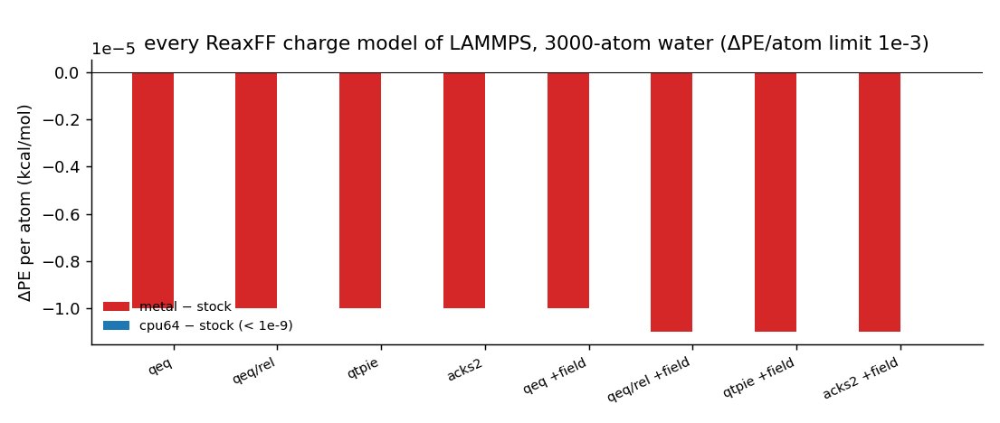
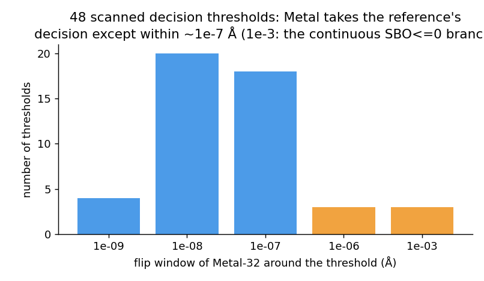

# ReaxMetal

**ReaxFF molecular dynamics on the Apple Metal GPU, as a LAMMPS plugin.**
`pair_style reaxff/metal` evaluates the complete ReaxFF force field (all 13 energy terms, forces, virial, per-atom energy and virial) and `fix qeq/reaxff/metal` solves the charge equilibration on the GPU.
Everything else (integrators, thermostats, barostats, minimisers, neighbor lists, MPI) is LAMMPS. Every number is validated against stock `pair_style reaxff` of LAMMPS `stable_30Sep2026`.
Element-agnostic: ordinary ReaxFF `ffield` files are read at run time.

**Why:** most ReaxFF work is single-core CPU, and that is fine for a few hundred atoms. At several thousand atoms and up, on a Mac with a big GPU that sits idle, it is not. This lets LAMMPS use the Apple GPU for ReaxFF (about 3.5× stock at 5k atoms, 7× at 24k, 10× at 66k; no gain below ~1,000 atoms).

## How do I use it with my LAMMPS?

It is a LAMMPS *plugin*: a `.so` you load at run time. You do not patch or rebuild LAMMPS, but the plugin must be built against the same LAMMPS version you run (pinned here: `stable_30Sep2026`; LAMMPS built as a shared library with plugin support, which `tools/build_lammps_reference.sh` does for you).

1. **Build once** (see [Build and test](#build-and-test-macos-apple-silicon)); you get `build/plugin/reaxmetaladapterplugin.so`.
2. **Change four lines of an existing ReaxFF input** (everything else — `read_data`, integrators, thermostats, `minimize`, dumps, `fix reaxff/bonds`, `fix reaxff/species` — stays as it is):

```diff
+ plugin load /path/to/reaxmetaladapterplugin.so
- pair_style reaxff NULL
+ pair_style reaxff/metal NULL backend metal
  pair_coeff * * ffield.reax.cho C H O
- fix q all qeq/reaxff 1 0.0 10.0 1e-6 reaxff
+ fix q all qeq/reaxff/metal 1 0.0 10.0 1e-6 reaxff
```
3. Run `lmp -in in.yours` as usual. Your `ffield` file is used unchanged. `qeq/rel/reaxff`, `qtpie/reaxff` and `acks2/reaxff` have `/metal` versions too.

Use `backend metal` for NVT/NPT and speed. For NVE energy conservation use `backend metal bonded cpu64`. Use `backend cpu64` to check against stock (agrees to ~1e-12). Details: [`docs/USER_MANUAL.md`](docs/USER_MANUAL.md).

<p align="center"></p>

*30,000 random carbon atoms, 1 g/cm³, NVT at 4000 K with the "2013 C" ReaxFF (Srinivasan, van Duin, Ganesh, J. Phys. Chem. A 119, 571), run with `reaxff/metal` on an M5 Max.
A 14 Å slab coloured by coordination: the random packing (left, 16 % 3-coordinated) condenses into a connected sp²-like network of 6-membered rings (right, 85 % after 90 ps).
The run was stopped at 90 ps of the planned 100 ps.*

<p align="center"></p>

## Results

<p align="center"></p>

*Time per MD step, CHO water, NVT, serial stock LAMMPS (1 core) vs `reaxff/metal` + `qeq/reaxff/metal` on the GPU, measured on an idle M5 Max. Below about 1,000 atoms the GPU does not help.*

| | |
|---|---|
|  |  |
| Force error against stock on 58 reference configurations: `cpu64` is the double-precision reference, `metal` the all-FP32 GPU engine, `mixed` runs the bond-order terms in double on the host and everything else on the GPU. | Energy conservation in NVE (VO oxide, 20 ps): the all-FP32 GPU mode is noisier than stock, the mixed mode is not. FP32 is fine for NVT/NPT; use `bonded cpu64` for NVE. |
|  |  |
| All ReaxFF charge models of LAMMPS (QEq, QEq-R, QTPIE, ACKS2, each with and without an electric field) on a 3000-atom water system: the energy matches stock to 1e-5 kcal/mol/atom on Metal and 1e-9 on `cpu64`. | Every discrete decision of the force field (bond-order cut-offs, 3-/4-body gates, H-bond gate, SBO branches, the lone-pair truncation, the non-bonded cut-off) is taken as in the reference except within about 1e-7 Å of a threshold. |

## What is validated against stock LAMMPS

| Area | Result |
|---|---|
| CPU-64 engine | energy 3e-15 relative, forces 3e-12 kcal/mol/Å on 58 reference configurations (frozen limits 2e-9 / 1e-9) |
| Metal-32 engine (FP32, no atomics, bitwise repeatable) | energy ≤ 1e-4 kcal/mol/atom, force max 4e-3 / RMS 9e-4 kcal/mol/Å (limits 1e-3 / 0.05 / 5e-3) |
| Charge models | `qeq/reaxff`, `qeq/rel/reaxff`, `qtpie/reaxff`, `acks2/reaxff`, `qeq/shielded`, parameter-file QEq, QEq on a subgroup, each with `fix efield` where applicable |
| `fix qeq/reaxff/metal` | GPU charge matrix on any number of ranks; `resident` (whole solve on the GPU, charges equal stock's to 1e-10 e), `strict`, `verify <eV>` |
| Dynamics | NVE, NVT, NPT, `minimize`, `hybrid/overlay` (charge-implicit ReaxFF + tabulated ZBL), shrink-wrapped boundaries, `fix wall/reflect`; NVT/NPT averages equal stock within block σ |
| Analysis | `compute pe/atom`, `stress/atom`, and the stock `fix reaxff/bonds`, `fix reaxff/species`, `compute reaxff/atom`, `compute SPEC/ATOM` work unmodified |
| MPI | 2 and 4 ranks equal stock on the same rank count (all ranks share one GPU: more ranks do not add speed) |
| FP32 decisions | 48 thresholds scanned, 290 configurations censused, no flip outside the FP32 window |
| Precision modes | `backend cpu64` · `backend metal` (GPU, FP32) · `backend metal bonded cpu64` (mixed, stock-like NVE conservation, ≈ 2× stock speed at 24k atoms) |

Test suite: 52 tests (56 with the MPI build tree). Every run, including the failures and the bugs found along the way, is recorded in [`docs/VALIDATION.md`](docs/VALIDATION.md) and [`docs/DEVELOPMENT_LOG.md`](docs/DEVELOPMENT_LOG.md).

## Limitations

* `backend metal` is single precision: in NVE the oxide test shows more total-energy noise than stock (use `bonded cpu64`); nearly linear atom triples (sin θ < 1e-3) carry an intrinsic FP32 force error.
* A step on which `pe/atom` / `stress/atom` is evaluated runs on the CPU engine.
* `tabulate` is accepted but non-bonded terms are evaluated analytically; the plugin checks the ghost shell width (`shellcheck no` disables the error, as stock never checks).
* `units real`, `newton on`, atom IDs and the `q` attribute are required (as stock). No Kokkos/OpenMP suffix styles. About 75 KB of memory per atom.
* Full list and the troubleshooting table: [`docs/USER_MANUAL.md`](docs/USER_MANUAL.md) §11.

## Use

```
plugin load /path/to/reaxmetaladapterplugin.so
pair_style reaxff/metal NULL backend metal          # backend cpu64 (default) | metal ; add "bonded cpu64" for stock-like NVE conservation
pair_coeff * * ffield.reax.cho C H O
fix q all qeq/reaxff/metal 1 0.0 10.0 1e-6 reaxff   # or any other ReaxFF charge fix; "checkqeq no" for fixed charges
fix integ all nvt temp 300 300 25.0                 # any LAMMPS integrator
```
Full manual (syntax of every keyword, charge models, precision modes, MPI, performance, limitations, troubleshooting): [`docs/USER_MANUAL.md`](docs/USER_MANUAL.md).
`REAXMETAL_PROFILE=1` prints per-phase wall times at exit.

### Example: random carbon at 1 g/cm³ (the renders above)
```
examples/graphitization/make_ffield.sh jp510274e_si_001.pdf ffield.reax.C2013    # force field from the paper's Supporting Information (not redistributed)
python3 examples/graphitization/make_box.py c30000.data --n 30000 --density 1.0  # random packing, 84.265 Å box
lmp -in examples/graphitization/in.graphitization -var data c30000.data -var ffield ffield.reax.C2013 -var plugin $PWD/build/plugin/reaxmetaladapterplugin.so
python3 examples/graphitization/analyze.py --box 84.26481 g4000.*.dump           # coordination and ring statistics
python3 docs/make_figures.py <dir with the dumps>                                # regenerates the figures of this README
```

## Build and test (macOS, Apple Silicon)

Stock pinned LAMMPS is built once, outside the repository (shared library, `LAMMPS_EXCEPTIONS`; add `-DBUILD_MPI=on` for an MPI LAMMPS):
```
tools/fetch_lammps.sh --full /path/lammps && tools/build_lammps_reference.sh /path/lammps /path/build /path/install
```
Then:
```
cmake -S . -B build -DREAXMETAL_ENABLE_METAL=ON -DREAXMETAL_BUILD_LAMMPS_PLUGIN=ON \
      -DREAXMETAL_LAMMPS_SOURCE_DIR=/path/lammps/src -DREAXMETAL_LAMMPS_PREFIX=/path/install \
      -DREAXMETAL_FFIELD_DIR=/path/lammps/potentials            # + -DREAXMETAL_LAMMPS_MPI=ON for an MPI LAMMPS
cmake --build build -j && ctest --test-dir build -j4 --output-on-failure
```
Shaders are compiled at run time (Command Line Tools suffice, no Xcode). Without `-DREAXMETAL_ENABLE_METAL=ON` the plugin still runs the double-precision CPU engine.
Long protocol runs (not in CTest): `tests/lammps/run_nve.py` (NVE 20 ps; `--nvt`, `--npt`), `tests/lammps/run_min.py`.

## Layout

| Where to look | What it is |
|---|---|
| `include/reaxmetal/terms.hpp` | pure ReaxFF term functions shared by the CPU engines and the Metal shaders |
| `src/cpu`, `src/neighbor` | CPU-64 engine (and its float twin), neighbor/ghost machinery, packing of device inputs |
| `src/metal` | Objective-C++ host and the MSL kernels |
| `plugin/adapter` | the LAMMPS plugin: `pair_style reaxff/metal` and the `/metal` charge fixes |
| `tests/` | unit tests, 58 reference fixtures (frozen hashes), in-LAMMPS A/B and dynamics harnesses |
| `examples/graphitization` | the 30,000-atom carbon example |
| `docs/USER_MANUAL.md` | user manual |
| `docs/ENGINE_SPEC.md`, `docs/NUMERICAL_POLICY.md` | the functional form as implemented by the reference and its quirks; precision tiers and tolerance protocol |
| `docs/VALIDATION.md`, `docs/DEVELOPMENT_LOG.md`, `docs/FEATURE_MATRIX.md` | results register, what was actually done (incl. mistakes), feature matrix |

Reference: LAMMPS `stable_30Sep2026`, commit `8de817dd79bfe4525d5d39246a212d833e6dee07`, GPL-2.0.

## License
GPL-2.0-only. See `LICENSE`, `REUSE.toml`, `THIRD_PARTY_NOTICES.md` and the per-file upstream audit `third_party/lammps/LICENSE_AUDIT.tsv`.
